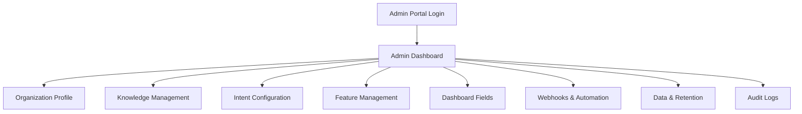
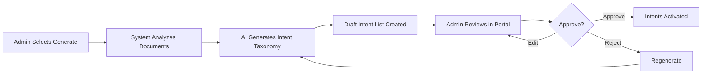
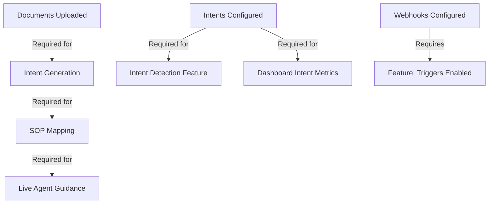
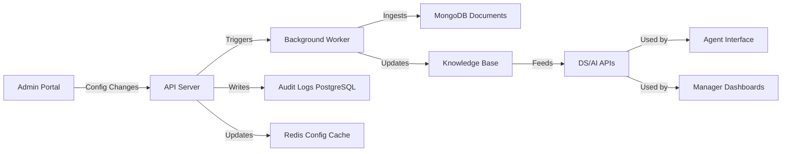

# Admin User Journey Design Document

**Version:** 1.0  
**Date:** 2026-01-29  
**Based on:** Agent Assist and Performance Dashboard BRD, Agent-Assist-Platform-Documentation

---

## 1. Executive Summary

### 1.1 Document Purpose

This document defines the **Client Admin User Journey** for the Shunya Agent Assist platform's self-serve onboarding portal. It encompasses:

- Initial onboarding workflows
- Day-to-day configuration management
- Screen-level component specifications
- User journeys and interaction flows

### 1.2 Scope & Key Assumptions

> [!IMPORTANT]
> **Core Assumptions**
> - **Single Admin Role**: No sub-roles (Editor/Viewer). All admins have full configuration authority
> - **Dashboard-Based Navigation**: Non-linear configuration (not wizard-based)
> - **Immediate Effect After Processing**: All admin actions take effect after system processing, no approval workflows
> - **Multi-Tenancy**: Each client organization operates as fully isolated tenant

> [!WARNING]
> **Out of Scope**
> - Telephony/CRM integration screens (separate project - **requires more info**)
> - SSO/SAML configuration (basic authentication only)
> - Sub-admin roles or granular permissions

### 1.3 Source Documents

- **[FROM BRD]** Section 8: Client Onboarding – Self-Serve Portal
- **[FROM PLATFORM DOC]** Technical architecture and data models

---

## 2. Admin Role & Permissions

### 2.1 Client Admin Role

**Access Level:** Full configuration authority

**Capabilities:**
- Upload and manage knowledge documents
- Configure intent taxonomies
- Enable/disable features
- Set up webhooks and automation
- Configure data retention policies
- View audit logs

**Restrictions:**
- Cannot access other tenants' data (multi-tenancy isolation)
- Cannot modify system-level infrastructure settings

### 2.2 Audit & Compliance

All admin actions must be logged with:
- **Who** performed the action (admin user ID)
- **What** was changed (resource type, ID)
- **When** (timestamp)
- **Previous vs new value** (for updates)

**[FROM BRD]** Version control and reversibility where applicable.

---

## 3. Admin Portal Architecture

### 3.1 High-Level Structure

### 3.2 Navigation Model

**Dashboard-Based (Non-Linear):**
- Admins can access any configuration area directly from main dashboard
- No forced sequential flow
- Each section can be configured independently
- System handles dependencies (e.g., warns if SOP uploaded without intents configured)

### 3.3 Common Processing Workflow

**[FROM BRD]** All configuration changes follow this pattern:

1. **Admin Action** → System logs action
2. **Processing State** → Status shows "Processing..."
3. **Data Ingestion** → Backend applies changes
4. **Validation** → System validates configuration
5. **Notification** → Admin notified when complete
6. **Activation** → Changes go live

---

## 4. Initial Onboarding Journey

### 4.1 Registration & Organization Setup

#### Screen: Registration Form

**Components:**

| Component | Type | Purpose | Validation |
|-----------|------|---------|------------|
| Company Name | Text Input | Organization identifier | Required, unique |
| Industry | Dropdown | Industry classification | Required |
| Primary Contact | Text Input | Admin contact email | Required, email format |
| Regions/Languages | Multi-select | Supported regions | At least 1 required |
| Telephony/CRM Environment | Text Input | **[REQUIRES CLARIFICATION]** | Optional |

**Buttons:**

| Button | Action | API Call | Navigation |
|--------|--------|----------|------------|
| Register | Create organization tenant | `POST /api/admin/organizations` | → Admin Dashboard |
| Cancel | Clear form | None | → Login page |

**Processing Flow:**
1. Submit registration
2. System creates isolated tenant
3. Generates `org_id`
4. Creates admin user account
5. Sends welcome email with portal access

---

### 4.2 Document & Knowledge Onboarding

#### Screen: Document Upload & Management

**Purpose:** Upload SOPs, knowledge base content, QA parameters, governance documents

**Components:**

| Component | Type | Purpose | Actions |
|-----------|------|---------|---------|
| Document Library Table | Data Table | Show uploaded documents | View, Replace, Deprecate |
| Upload Button | Action Button | Trigger file upload modal | Opens upload dialog |
| Tag Filters | Filter Group | Filter by process/queue/language | Real-time filtering |
| Version History Link | Link | **[HIGH COMPLEXITY]** View document versions | Opens version modal |

**Document Types** **[FROM BRD]**:
- SOP Documents
- Process Documents
- Knowledge Base Content
- QA Parameter Documents (Communication skill SOP, Process SOP, Resolution framework, Upselling framework)
- Governance & Guardrails Documents

**System Actions During Processing:**
- Ingest content
- Apply across: Agent guidance, chat, compliance, QA, intelligence modules
- Update knowledge base
- Re-index for search/RAG

> [!CAUTION]
> **High Complexity Feature - Document Version Control**
> 
> Version history requires:
> - Diff viewing between versions
> - Rollback capability
> - Impact analysis (which agents/sessions affected)
> - Change tracking across distributed systems

---

### 4.3 Intent Configuration Workflow

**[FROM BRD]** Two-path decision based on whether client has existing intent list.

#### Screen: Intent Configuration Choice

**Options:**
1. Path A: "I have an intent list" - Upload existing taxonomy
2. Path B: "I don't have an intent list" - Shunya generates one

#### Path B: Shunya Generates Intent List (Detailed)

**Processing Steps:**

**Review Screen Components:**

| Component | Type | Purpose | Actions |
|-----------|------|---------|---------|
| Generated Intents Table | Editable Table | Show AI-generated intents | Edit, Delete, Add |
| Intent Name | Text Input (inline) | Intent identifier | Editable |
| Intent Description | Text Area (inline) | Intent definition | Editable |
| Keywords | Tag Input | Trigger keywords | Add/remove tags |
| Add Intent Button | Action Button | Manual intent creation | Opens add form |
| Approve All Button | Action Button | Approve taxonomy | Activates intents |
| Regenerate Button | Action Button | Request new generation | Restarts AI process |

**Buttons:**

| Button | Action | API Call | Result |
|--------|--------|----------|--------|
| Edit (inline) | Enable editing | None | Inline editing enabled |
| Delete | Remove intent | `DELETE /api/admin/intents/draft/{id}` | Intent removed from draft |
| Add New Intent | Open creation form | None | Modal opens |
| Save Draft | Save without activating | `PUT /api/admin/intents/draft` | Draft saved for later |
| Regenerate | Request new AI generation | `POST /api/admin/intents/generate` | New draft created |
| Approve & Activate | Finalize and activate | `POST /api/admin/intents/activate` | Intents go live |

**Activation Behavior** **[FROM BRD]**:
- Only after explicit approval are intents activated
- Mapped to SOPs (if SOPs already uploaded)
- Used in live calls and dashboards
- All stages audit-logged

---

### 4.4 Feature Selection & Enablement

#### Screen: Feature Management Panel

**Purpose:** Enable/disable platform features for agents and managers

**Agent Assist Features** **[FROM BRD]**:
- Call Transcription (Post-call)
- Live Intent Detection
- Live Sentiment (Customer & Agent)
- Next-Best-Action Suggestions
- Real-Time Agent Chat Assistant
- Pre-filled Ticket Creation
- Compliance Monitoring
- Upsell / Cross-sell Nudges
- Translation (Multilingual)
- Triggers through Webhooks

**Manager & Supervisor Features** **[FROM BRD]**:
- Overview Dashboard
- Agent Performance Dashboard
- Sessions & Session Detail
- Advanced Intelligence
- Live Call Monitoring & Intervention
- Live Call Analysis for Every Agent

**System Behavior** **[FROM BRD]**:
- Changes take effect only after ingestion & validation
- UI dynamically adjusts per enabled features
- Agent/Manager interfaces reflect configuration

---

### 4.5 Dashboard Field Configuration

#### Screen: Dashboard Field Selector

**Purpose:** Choose which analytics fields appear in dashboards, session views, and exports

**Field Categories** **[ASSUMPTION]**:
- **Call Metrics**: Duration, resolution status, queue time
- **Sentiment Metrics**: Customer sentiment, agent sentiment, sentiment timeline
- **QA Metrics**: QA score, SOP adherence, compliance flags
- **Intent Data**: Detected intents, intent changes
- **Agent Metrics**: Handle time, first call resolution, upsell success

**Visibility Scopes:**
- Dashboard display
- Session detail view
- Export files

**System Behavior** **[FROM BRD]**:
- Changes are audit-logged
- Trigger configuration updates
- Take effect after processing
- Notify client once live

---

### 4.6 Automation, Triggers & Webhooks

#### Screen: Webhook Configuration

**Purpose:** Configure external system triggers based on call events

**Webhook Configuration Fields** **[FROM BRD]**:

| Field | Type | Purpose | Required |
|-------|------|---------|----------|
| Webhook Name | Text | Identifier | Yes |
| Event Type | Dropdown | Trigger condition | Yes |
| Target System | Text | External system name | No |
| Endpoint URL | URL | Webhook destination | Yes |
| Agent Acceptance Required | Checkbox | Require confirmation | No (default: false) |
| Headers | Key-Value Pairs | Authentication headers | No |

**Trigger Events:**
- SOP Step Complete
- Agent Action
- Call Outcome
- Upsell Success
- Upsell Failure
- Compliance Event

**Behavior** **[FROM BRD]**:

**If Agent Acceptance Required:**
1. Event occurs during call
2. Agent sees prompt: "Trigger [Webhook Name]?"
3. Agent confirms/rejects
4. Webhook fires only after confirmation

**If Agent Acceptance NOT Required:**
1. Event occurs
2. Webhook fires automatically
3. Logged for traceability

**All trigger executions logged with:**
- Session ID
- Timestamp
- Payload sent
- Response received
- Success/failure status

---

### 4.7 Data & Retention Policy Configuration

#### Screen: Data & Retention Settings

**Purpose:** Configure data storage location and retention policies

**Options** **[FROM BRD]**:

| Setting | Options | Default |
|---------|---------|---------|
| Call Recording Storage | Client / Shunya | Shunya |
| Retention Duration | 30-730 days | 90 days |
| Auto-Deletion | Enabled / Disabled | Enabled |

**System Behavior** **[FROM BRD]**:
- Enforce time-based deletion
- Support secure purging
- Log all data lifecycle events
- TTL applied to session documents based on policy

---

## 5. Day-to-Day Configuration Management

### 5.1 Admin Dashboard (Home Screen)

**Purpose:** Central navigation hub for all admin functions

**Dashboard Sections:**
- Organization summary
- Quick stats (active features, document count, active agents)
- Processing status panel (ongoing operations)
- Recent activity feed (audit log preview)
- Configuration cards (navigation to each section)

---

### 5.2 Knowledge Management (Ongoing)

**Purpose:** Manage documents after initial onboarding

**Key Actions:**

| Action | When | API Call | Result |
|--------|------|----------|--------|
| Upload New Document | Always available | `POST /api/admin/documents` | New doc added |
| Replace Document | Click Replace on row | `PUT /api/admin/documents/{id}` | Version incremented |
| Deprecate Document | Click Deprecate | `PATCH /api/admin/documents/{id}/deprecate` | Status = Deprecated |
| View History | Click version link | `GET /api/admin/documents/{id}/versions` | **[HIGH COMPLEXITY]** Opens version modal |

---

### 5.3 Intent Management (Ongoing)

**Purpose:** Modify intent taxonomy after initial setup

**Actions:**

| Action | API Call | Result |
|--------|----------|--------|
| Edit | `PUT /api/admin/intents/{id}` | Opens edit form |
| Delete | `DELETE /api/admin/intents/{id}` | Warns if in use, then deletes |
| Add New | `POST /api/admin/intents` | Opens creation form |
| Map SOP | `PATCH /api/admin/intents/{id}/mapping` | Associates intent with SOP doc |

---

### 5.4 Webhook & Automation Management (Ongoing)

**Purpose:** Manage webhooks after initial setup

**Execution Log Viewer Components:**
- Log table showing webhook execution history
- Filters (Date range, status, webhook)
- Retry button for failed webhooks

**Log Table Columns:**
- Timestamp
- Webhook Name
- Event Type
- Session ID (call that triggered it)
- Payload (expandable JSON)
- Response Code
- Status (Success/Failed)
- Actions (Retry, View Details)

---

### 5.5 Audit Log Viewer

**Purpose:** View all admin configuration changes

**Audit Event Types** **[FROM PLATFORM DOC]**:

| Category | Events Logged | Fields Captured |
|----------|---------------|-----------------|
| Authentication | Login, logout, failed attempts | user_id, ip, user_agent, timestamp |
| Data Access | Session view, transcript view, export | user_id, resource_id, action |
| Configuration | Feature toggle, webhook change, doc upload | old_value, new_value, who, when |
| User Management | Create, update role, deactivate | target_user, changes, admin_id |

---

## 6. User Journeys & Workflows

### 6.1 Journey: First-Time Setup (No Existing Intents)

**Step-by-Step:**

1. **Registration** (5-10 min) - Fill organization profile, submit
2. **Document Upload** (15-30 min) - Upload SOPs, tag, wait for processing
3. **Intent Configuration** (10-20 min) - Generate, review, edit, approve intents
4. **Feature Selection** (5-10 min) - Enable desired features
5. **Dashboard Configuration** (5 min) - Select analytics fields
6. **Webhook Setup** (Optional, 10-15 min) - Define triggers, configure endpoints
7. **Retention Policy** (2-3 min) - Set retention duration

**Total Estimated Time:** 1-2 hours

---

### 6.2 Journey: Adding New SOP Documents (Mid-Lifecycle)

**Time:** 5-10 minutes

**Steps:**
1. Login to admin portal
2. Navigate to Knowledge Management
3. Click Upload New Document
4. Select file, choose type, tag
5. Submit upload
6. Monitor processing status
7. Receive notification when active
8. (Optional) Map to intents if needed

---

### 6.3 Journey: Configuring a New Webhook

**Time:** 10-15 minutes

**Steps:**
1. Navigate to Webhooks & Automation
2. Click Add New Webhook
3. Enter name, select event type
4. Configure endpoint URL and headers
5. Decide on agent acceptance requirement
6. Test webhook
7. If successful, save
8. Monitor execution logs

---

## 7. Component Interaction & Dependencies

### 7.1 Configuration Dependencies

### 7.2 Data Flow Between Components

---

## 8. Open Questions for Management

> [!NOTE]
> **Purpose of This Section**
> These questions highlight gaps in the provided documentation. Management should address these to ensure complete system design.

### 8.1 User Management
**[REQUIRES CLARIFICATION]**
- How do Client Admins invite other admin users?
- Is there admin user management UI?
- Can admins deactivate other admins?

### 8.2 Billing & Subscription
**[REQUIRES CLARIFICATION]**
- Is there a billing section in admin portal?
- Can admins view usage metrics?
- Can admins upgrade/downgrade plans?

### 8.3 White-Labeling Configuration
**[REQUIRES CLARIFICATION]**
- What branding elements can admins customize?
- Logo upload? Color scheme? Custom domain?

### 8.4 Multi-Language Content
**[REQUIRES CLARIFICATION]**
- How are language-specific SOPs configured?
- Language fallback logic?
- Coverage dashboard?

### 8.5 Telephony/CRM Integration
**[REQUIRES MORE INFO - SEPARATE PROJECT]**
- Supported systems? (Twilio, Genesys, Five9?)
- Integration wizard flow?
- API key entry? OAuth?
- Connection testing?

### 8.6 SSO/SAML Authentication
**[OUT OF SCOPE - BASIC AUTH ONLY]**
- Future SSO/SAML configuration?
- SCIM provisioning?

### 8.7 API Key Management
**[REQUIRES CLARIFICATION]**
- Can admins generate API keys?
- Key rotation policy?
- Revocation workflow?

### 8.8 Custom Alert Configuration
**[REQUIRES CLARIFICATION]**
- Custom alert rules?
- Notification channels?
- Alert thresholds?

### 8.9 System Health Monitoring
**[REQUIRES CLARIFICATION]**
- Platform health visibility?
- API latency, error rates?
- Service status page?

### 8.10 Data Export & Compliance
**[REQUIRES CLARIFICATION]**
- Bulk data export?
- Export formats?
- GDPR compliance tools?

---

## 9. Technical Considerations

### 9.1 Processing Time SLAs

**[ASSUMPTION]** Target processing times:

| Process | Target Time | Max Acceptable |
|---------|-------------|----------------|
| Document Ingestion | 2-5 minutes | 10 minutes |
| Intent Activation | 30 seconds | 2 minutes |
| Feature Toggle | Immediate | 10 seconds |
| Webhook Config | Immediate | 5 seconds |

### 9.2 Notification Mechanisms

**[REQUIRES CLARIFICATION]** How are admins notified?

**[ASSUMPTION]** Likely methods:
- In-portal notification
- Email notification
- Optional: Slack/webhook

---

## 10. Document Conventions Legend

| Notation | Meaning |
|----------|---------|
| **[FROM BRD]** | From BRD Section 8 |
| **[FROM PLATFORM DOC]** | From Platform Documentation |
| **[ASSUMPTION]** | Logical assumption based on standards |
| **[REQUIRES CLARIFICATION]** | Needs management input |
| **[REQUIRES MORE INFO]** | Mentioned but lacks detail |
| **[HIGH COMPLEXITY]** | Technically challenging feature |
| **[OUT OF SCOPE]** | Excluded from current phase |

---

## 11. Summary & Next Steps

### 11.1 Document Coverage

✅ Admin role definition and permissions  
✅ Initial onboarding flow for both intent scenarios  
✅ Day-to-day configuration management screens  
✅ Detailed component specifications  
✅ User journeys  
✅ Component interaction mapping  
✅ Open questions for management  

### 11.2 Recommended Next Steps

1. **Management Review** of open questions (Section 8)
2. **Technical Feasibility Review** of high-complexity features
3. **UX/UI Design Phase** - Create high-fidelity mockups
4. **API Specification** - Detail all endpoints
5. **Implementation Planning** - Backend & frontend architecture

---

**End of Document**
